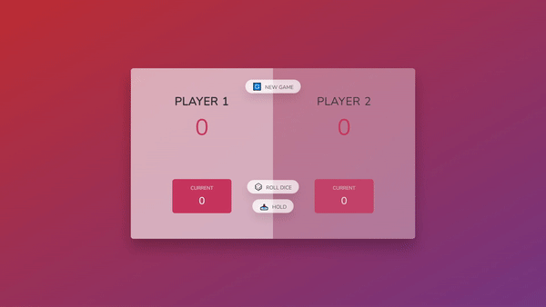

<h1>A pig game made wih JS DOM manipulation.</h1>

<ul>
<li>There are two players</li>
  <li>The objective of the game is to get to 100 by rolling the dice.</li>
  <li>Everytime you roll the dice, whatever number yoy get will be added to your turn's point, which will be then added to your overall score.</li>
  <liIf you roll the dice and get "1", your turn's points, howevery, will reset to 0 and it will be the other's player turn to play.</li>
  <li>You can "hold" onto your turn's points, adding them safely to your score and let the other player play, or roll again if you feel lucky.</li>
</ul>

Hosted on GitHub Pages, link: https://ivanaogrizovic.github.io/pig-game/

